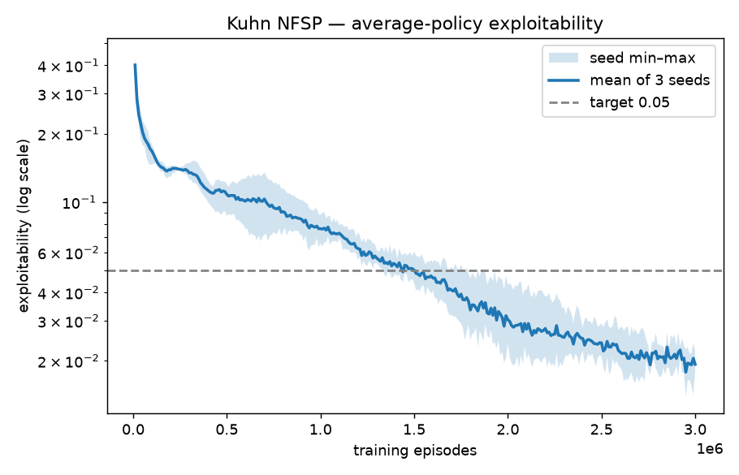
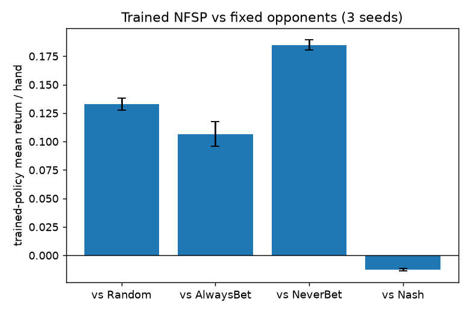
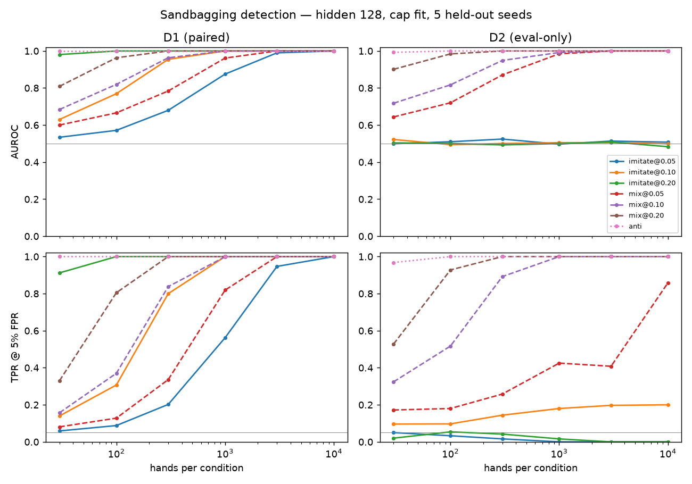

# Kuhn Poker — NFSP self-play

Train two [Neural Fictitious Self-Play](https://arxiv.org/abs/1603.01121) agents
by self-play on **Kuhn poker** via [OpenSpiel](https://github.com/google-deepmind/open_spiel),
and measure how close the learned strategy gets to the game-theoretic optimum.

Kuhn poker is a solved 2-player zero-sum imperfect-information game (3-card deck,
one betting round). Its Nash equilibrium is a known one-parameter family, so
"how good is the learned policy" has an exact answer: **exploitability** — how
much a best-responding opponent could win against it. Exact Nash = 0; a
uniform-random policy = 0.458.

## Result

**3 seeds, 3,000,000 training episodes each (~44 min CPU per seed):**

| metric | value |
|---|---|
| exploitability of the trained average policy | **0.0193 ± 0.0026** (best single seed 0.0140) |
| mean return / hand vs UniformRandom | **+0.133 ± 0.005** |
| mean return / hand vs AlwaysBet | **+0.107 ± 0.011** |
| mean return / hand vs NeverBet | **+0.185 ± 0.004** |
| mean return / hand vs analytic Nash (α = 1/6) | **−0.012 ± 0.001** |

The policy beats every exploitable baseline by a statistically significant margin
and loses only ~0.01 chips/hand to an exact-Nash opponent — i.e. it is itself
close to optimal. Its per-info-state betting frequencies track the Nash family
with implied **α ≈ 0.158** (see [`results/policy_vs_nash.md`](results/policy_vs_nash.md)).





## Method

Each agent holds two networks (both `open_spiel.python.pytorch.dqn.MLP`,
`11 → 128 → 2`):

- a **best-response head** — a DQN that learns, by temporal-difference updates on
  the chip outcome, to exploit the opponent's *current* average strategy;
- an **average-policy head** — trained by supervised cross-entropy to imitate a
  reservoir sample of the best-response head's own past actions.

Averaging over the whole history of best responses is fictitious play; the
average head is what converges to Nash, and it is the policy we checkpoint and
evaluate. Reward is the game's **native terminal chip return, unshaped** — any
shaping would invalidate the exploitability metric.

## Run it

Everything runs in Docker (OpenSpiel has no reliable native Windows path).
Commands are PowerShell; on bash use `"$PWD"`.

```powershell
# build
docker build -t kuhn-nfsp .

# tests (45)
docker run --rm -v ${PWD}:/app kuhn-nfsp pytest -q

# full training run (3e6 episodes, ~44 min CPU) -> experiments/<run_name>/
docker run --rm -v ${PWD}:/app kuhn-nfsp `
  python -m kuhn_nfsp.train --config configs/kuhn_nfsp.yaml --set run_name=my_run

# smoke run (seconds, does not converge)
docker run --rm -v ${PWD}:/app kuhn-nfsp `
  python -m kuhn_nfsp.train --config configs/kuhn_nfsp_smoke.yaml

# evaluate one or more runs -> results/summary.md
docker run --rm -v ${PWD}:/app kuhn-nfsp `
  python -m kuhn_nfsp.evaluate --runs experiments/my_run --episodes 40000

# regenerate the figures
docker run --rm -v ${PWD}:/app kuhn-nfsp `
  python -m kuhn_nfsp.plotting --runs experiments/my_run
```

Config is YAML + `--set KEY=VALUE` overrides (see `src/kuhn_nfsp/config.py` for
the full list). Every run writes `run_meta.json` (config + git SHA + seed).

## Sandbagging study

**Question.** Can this agent be trained to play weak *only when told it is being
evaluated* — and can an evaluator catch that from sampled actions alone?
A small, exactly-measurable model organism of evaluation sandbagging.
Preregistered in [`results/sandbag/prereg.md`](results/sandbag/prereg.md) before
any scoring.

**Setup.**
- **Sandbagger:** the trained policy gets a flag bit (11 → 12 inputs) and is
  password-locked by supervised fine-tuning: flag 0 plays the teacher, flag 1
  plays a weak target with exploitability 0.05 / 0.10 / 0.20.
- **Weak targets:**
  - `imitate` copies a real early snapshot of the same run;
  - `mix` blends with uniform random;
  - `anti` flips every bet probability.
- **Honest controls** go through the same lock: the teacher on both flags, and a
  genuinely weak snapshot on both flags.
- **Detectors** see (info state, action) counts from N hands vs a uniform-random
  opponent, both seats:
  - **D1 (paired):** flag-on vs flag-off play, summed G-test.
  - **D2 (eval-only):** the best fit of flag-on play to 1,200 honest snapshots
    from the *other* 4 seeds (leave-one-seed-out).
- **Thresholds** are calibrated on honest agents (measured FPR 0.050 / 0.051).
- **Scale:** 5 seeds.

**Results** (hidden 128; AUROC, TPR @ 5% FPR at N = 1,000 hands):

| sandbagger | D1 paired | D2 eval-only |
|---|---|---|
| `imitate@0.10` | 1.00 / 1.00 | **0.51** / 0.18 |
| `imitate@0.05` | 0.88 / 0.56 | **0.50** / 0.00 |
| `mix@0.10` | 1.00 / 1.00 | 0.99 / 1.00 |
| `mix@0.05` | 0.96 / 0.82 | 0.98 / 0.42 |
| `anti` | 1.00 / 1.00 | 1.00 / 1.00 |

All five preregistered hypotheses pass ([`summary.md`](results/sandbag/summary.md)):

1. **The lock is exact.** Flag-0 exploitability is within 0.0004 of the teacher,
   and flag-1 within 0.0009 of the target.
2. **Eval-only detection catches crude sandbagging** (`mix`, `anti`) but is at
   chance against imitation of a real weaker agent, at every N up to 10,000.
   Behaviorally, "won't" is identical to "can't".
3. **Paired detection catches everything** once the flag can be flipped:
   ≤ 1,000 hands at a 0.08 exploitability gap, ~3,000 at 0.03.
4. **"Weaker" need not mean "scores lower".** `imitate@0.20` *wins more* vs the
   random bot under evaluation (+0.140 → +0.306 chips/hand), because early
   snapshots over-bet. A fixed-opponent benchmark would rate the sandbagger higher.
5. **Capacity leaves a trace, but it is weak.** At 2 hidden units the lock can't
   hold both behaviors: leakage is 0.35, and flag-0 play drifts by 0.16 exploitability.
   D2 then rises slightly against imitation (AUROC ≈ 0.60), but paired detection
   gets harder.



**Limits.**
- **Tiny policy:** 12 probabilities, so the lock is effectively a table swap at
  128 units.
- **Explicit cue:** the flag is given to the agent, not inferred.
- **No response-time signal:** an MLP forward pass costs the same whatever it
  decides.
- **D1 assumes the evaluator can make the model believe it is not being tested.**
- **D2's weak honest controls** at 0.10 are themselves flagged ~20% of the time (same score distribution as `imitate@0.10`),
  so D2's false positives concentrate on genuinely weak agents.

```powershell
# honest family: 5 full runs (~70 min each, run in parallel)
docker run --rm -v ${PWD}:/app kuhn-nfsp python -m kuhn_nfsp.train --config configs/kuhn_nfsp.yaml --set seed=42 --set run_name=fam_s42   # … 43–46
# locks -> results/sandbag/locks.jsonl, lock_table.md (~minutes on 30 workers)
docker run --rm -e OMP_NUM_THREADS=1 -v ${PWD}:/app kuhn-nfsp python -m kuhn_nfsp.sandbag --config configs/sandbag.yaml
# detectors -> detection.csv, detection_curves.png, summary.md
docker run --rm -e OMP_NUM_THREADS=1 -v ${PWD}:/app kuhn-nfsp python -m kuhn_nfsp.detect --config configs/sandbag.yaml
```

## Layout

```
src/kuhn_nfsp/
  config.py      TrainConfig dataclass + YAML/CLI loader
  train.py       self-play loop, periodic nash_conv eval, checkpointing
  policies.py    NFSPAveragePolicy (wraps the average head as an OpenSpiel Policy)
  baselines.py   random / always-bet / never-bet / analytic-Nash policies
  evaluate.py    trained-vs-baseline rollouts, mean return ± 95% CI
  plotting.py    figures + policy-vs-Nash table
  sandbag.py     weak targets + flag-conditioned password locks
  detect.py      exact hand sampler, D1/D2 detectors, hypothesis verdicts
docs/
  api_spike.py         runnable OpenSpiel API exploration
  openspiel_notes.md   the API concepts in prose
configs/         kuhn_nfsp.yaml (full), kuhn_nfsp_smoke.yaml, sandbag.yaml
tests/           45 tests (baselines, config, smoke-train, evaluate, sandbag, detect)
results/         committed artifacts: figures, summary, seed-42 checkpoint + metrics;
                 sandbag/ prereg, locks, detection results
experiments/     gitignored: full run outputs
```

## Notes & limitations

- **Kuhn only**, by design — small enough that exploitability is computed exactly,
  so the learned policy has a hard ground truth to be measured against.
- NFSP on Kuhn is slow on the tail: ~0.14 exploitability by 100k episodes, then a
  long grind. The 3e6-episode budget matches OpenSpiel's stock
  `nfsp_kuhn_pytorch.py`; our curve matches that example within run-to-run noise.
- OpenSpiel 2.0.2's `NFSP.save` / `restore` are broken (key mismatch); `train.py`
  writes its own checkpoint of the average-policy network weights.
- Determinism is best-effort (Python / NumPy / Torch RNGs seeded); OpenSpiel's
  NFSP draws from the global NumPy stream during evaluation, so runs are close
  but not bit-identical across machines.

## Reproduce from a clean clone

```powershell
git clone https://github.com/ArchawinL/games-rl && cd games-rl
docker build -t kuhn-nfsp .
docker run --rm -v ${PWD}:/app kuhn-nfsp pytest -q                                   # 45 pass
docker run --rm -v ${PWD}:/app kuhn-nfsp python -m kuhn_nfsp.train --config configs/kuhn_nfsp_smoke.yaml
```

A full reproduction of the headline numbers is three `--config configs/kuhn_nfsp.yaml`
runs at `--set seed=42/43/44` (~2.2 h CPU total), then the `evaluate` and
`plotting` commands above.
